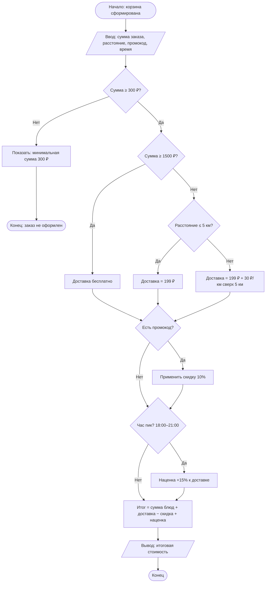

# Блок-схема: Расчёт стоимости заказа с доставкой

**Алгоритм:** определение итоговой суммы заказа с учётом минимальной суммы, стоимости доставки, скидки по промокоду и наценки в час пик.

```mermaid
flowchart TD
    Start([Начало: корзина сформирована]) --> Input[/Ввод: сумма заказа, расстояние, промокод, время/]
    Input --> MinCheck{Сумма ≥ 300 ₽?}

    MinCheck -- Нет --> TooSmall[Показать: минимальная сумма 300 ₽]
    TooSmall --> End2([Конец: заказ не оформлен])

    MinCheck -- Да --> CheckFree{Сумма ≥ 1500 ₽?}
    CheckFree -- Да --> FreeDelivery[Доставка бесплатно]
    CheckFree -- Нет --> CheckDistance{Расстояние ≤ 5 км?}

    CheckDistance -- Да --> BaseDelivery[Доставка = 199 ₽]
    CheckDistance -- Нет --> FarDelivery[Доставка = 199 ₽ + 30 ₽/км сверх 5 км]

    FreeDelivery --> CheckPromo
    BaseDelivery --> CheckPromo
    FarDelivery --> CheckPromo

    CheckPromo{Есть промокод?}
    CheckPromo -- Да --> ApplyPromo[Применить скидку 10%]
    CheckPromo -- Нет --> CheckPeak

    ApplyPromo --> CheckPeak{Час пик? 18:00–21:00}

    CheckPeak -- Да --> AddPeak[Наценка +15% к доставке]
    CheckPeak -- Нет --> Total

    AddPeak --> Total[Итог = сумма блюд + доставка − скидка + наценка]
    Total --> Output[/Вывод: итоговая стоимость/]
    Output --> End([Конец])
```