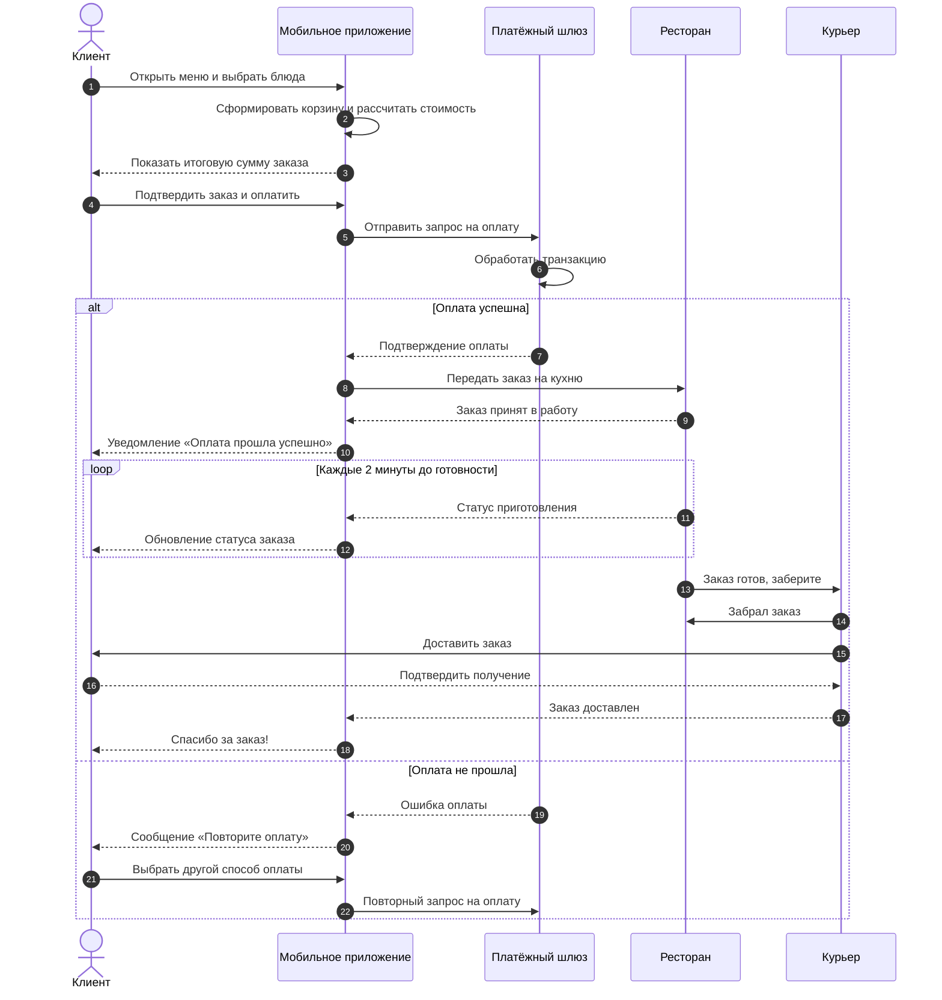

# Диаграмма последовательности: Заказ еды с доставкой

**Сценарий:** Клиент оформляет заказ, оплачивает его, ресторан принимает заказ, курьер доставляет.

```mermaid
sequenceDiagram
    autonumber
    actor Клиент
    participant Приложение as Мобильное приложение
    participant Шлюз as Платёжный шлюз
    participant Ресторан
    participant Курьер

    Клиент->>Приложение: Открыть меню и выбрать блюда
    Приложение->>Приложение: Сформировать корзину и рассчитать стоимость
    Приложение-->>Клиент: Показать итоговую сумму заказа

    Клиент->>Приложение: Подтвердить заказ и оплатить
    Приложение->>Шлюз: Отправить запрос на оплату
    Шлюз->>Шлюз: Обработать транзакцию

    alt Оплата успешна
        Шлюз-->>Приложение: Подтверждение оплаты
        Приложение->>Ресторан: Передать заказ на кухню
        Ресторан-->>Приложение: Заказ принят в работу
        Приложение-->>Клиент: Уведомление «Оплата прошла успешно»

        loop Каждые 2 минуты до готовности
            Ресторан-->>Приложение: Статус приготовления
            Приложение-->>Клиент: Обновление статуса заказа
        end

        Ресторан->>Курьер: Заказ готов, заберите
        Курьер->>Ресторан: Забрал заказ
        Курьер->>Клиент: Доставить заказ
        Клиент-->>Курьер: Подтвердить получение
        Курьер-->>Приложение: Заказ доставлен
        Приложение-->>Клиент: Спасибо за заказ!
    else Оплата не прошла
        Шлюз-->>Приложение: Ошибка оплаты
        Приложение-->>Клиент: Сообщение «Повторите оплату»
        Клиент->>Приложение: Выбрать другой способ оплаты
        Приложение->>Шлюз: Повторный запрос на оплату
    end
```