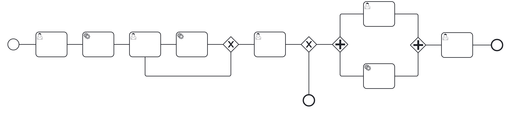
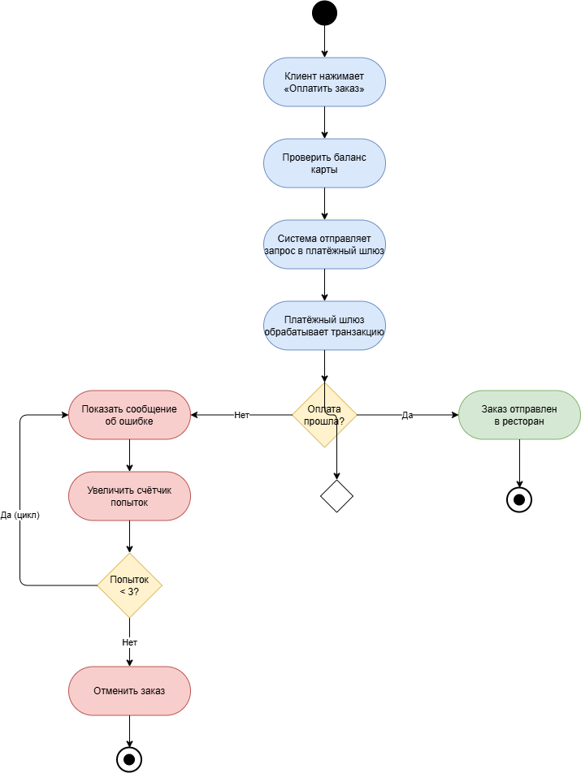
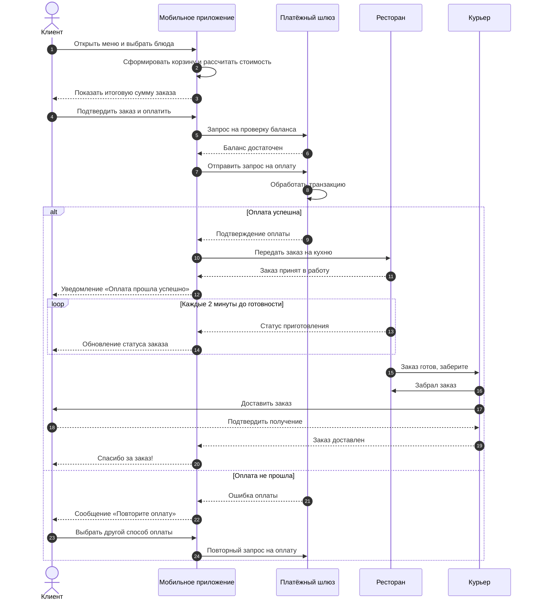
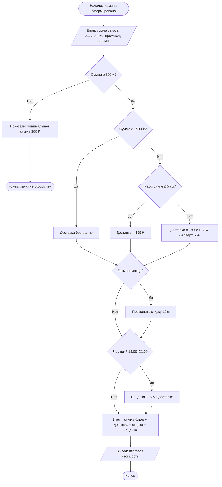

# Лабораторная работа №1. Визуальное программирование

**Тема:** Заказ еды в ресторане с доставкой
**Студент:** Носко Анастасия Дмитриевна
**Группа:** СДП-ИИ-241

---

## 1. Краткое описание процесса

В лабораторной работе я описал процесс заказа еды в ресторане с доставкой. Клиент выбирает блюда в мобильном приложении, оплачивает заказ, после чего ресторан принимает заказ и готовит блюда, а курьер доставляет его клиенту. В процессе есть две точки ветвления: проверка успешности оплаты и проверка доступности ресторана. Также есть параллельные действия — пока повар готовит блюда, система назначает курьера и строит маршрут.

---

## 2. Диаграммы

### 2.1. BPMN-диаграмма (бизнес-процесс)

**Исходник:** [`lab1/diagrams/process.bpmn`](diagrams/process.bpmn)

BPMN-диаграмма описывает весь процесс целиком: от открытия приложения клиентом до получения заказа. Обязательные элементы: стартовое событие, 8 задач, 2 XOR-шлюза (проверка оплаты и доступности ресторана), параллельный шлюз AND с двумя ветками (приготовление и назначение курьера), 2 конечных события. Также добавлено промежуточное событие-таймер «Ожидание 1 мин».

### 2.2. UML Activity Diagram (оплата заказа)

**Исходник:** [`lab1/diagrams/activity.drawio`](diagrams/activity.drawio)

UML Activity Diagram детализирует шаг оплаты заказа. На диаграмме есть начальный узел, 7 действий, два узла решения (проверка успешности оплаты и проверка количества попыток) и цикл повторной оплаты при ошибке, а также два конечных узла — успех и отмена заказа.

### 2.3. Sequence Diagram (Mermaid)

**Исходник:** [`lab1/docs/sequence.md`](docs/sequence.md)

Диаграмма последовательности показывает обмен сообщениями между пятью участниками: клиентом, приложением, платёжным шлюзом, рестораном и курьером. Есть блок `alt` для ветвления (успех/ошибка оплаты) и блок `loop` для повторяющегося обновления статуса.

### 2.4. Flowchart (Mermaid)

**Исходник:** [`lab1/docs/flowchart.md`](docs/flowchart.md)

Блок-схема описывает алгоритм расчёта итоговой стоимости заказа. Есть четыре условия: проверка минимальной суммы, порога бесплатной доставки, расстояния, промокода и часа пик. В зависимости от них меняется стоимость доставки и итоговая цена.

---

## 3. Выводы

В ходе лабораторной работы я научился описывать один и тот же бизнес-процесс с помощью разных нотаций: BPMN, UML Activity, Sequence Diagram и Flowchart. Я понял, что BPMN удобнее для описания всего процесса с ролями и параллельными действиями, UML Activity — для детализации отдельного алгоритма с циклом, а Sequence Diagram — для показа обмена сообщениями между участниками. Mermaid оказался очень удобным для хранения диаграмм прямо в markdown-файлах, потому что diff таких файлов читается легко. Также я на практике увидел, как Git по-разному отслеживает изменения: текстовые форматы (.bpmn, .drawio, .md) дают построчный diff, а бинарные (.png) — только сообщение «binary files differ». Это важно учитывать при работе в команде, чтобы не потерять изменения в изображениях.